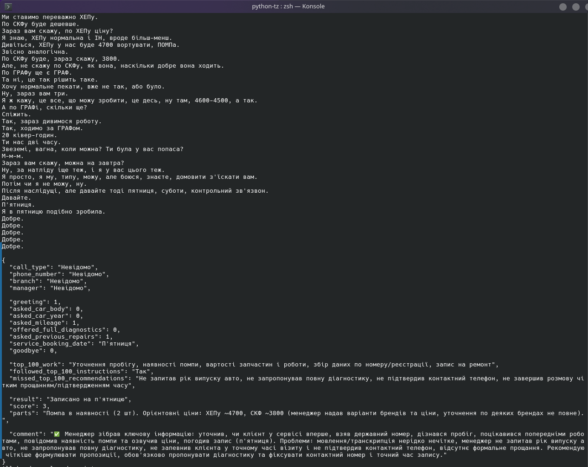
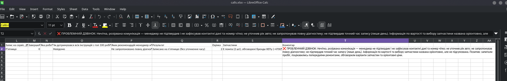

To simplify the process Audio files are stored in the "Audio" folder.
Styles also missing in result exel

# HOW TO RUN

1. Create and activate virtual environment:

```bash
python -m venv venv
source venv/bin/activate
```

2. Install dependencies:

```bash
pip install -U faster-whisper openpyxl openai
```

3. Add audio file into `audio/` folder and set the `audio_path` in `main.py`.

4. Run:

```bash
python main.py
```

# .env

```env
OPENAI_API_KEY=your_openai_api_key_here
```

# EXAMPLES



